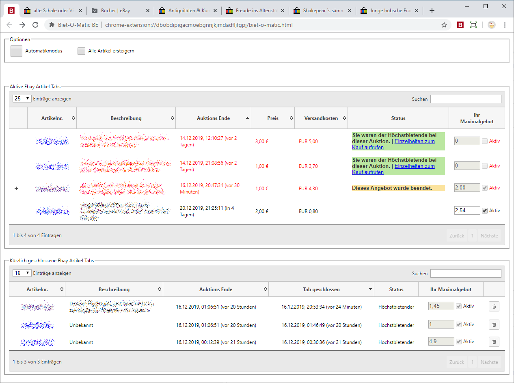
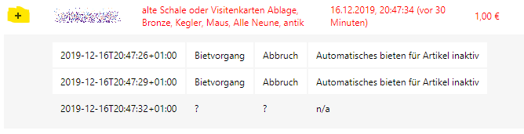
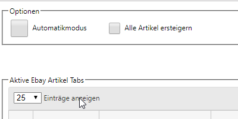
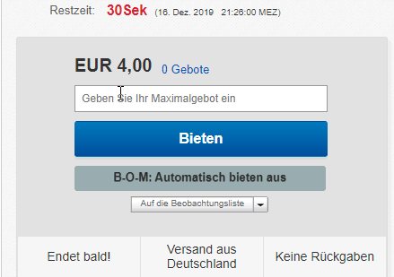

# Bid-O-Matic Browser Extension

Bid-O-Matic (BOM) Browser Extension (BE) is intended to improve the shopping experience for the eBay platform.
It adds an overview page which can be used to keep your auctions organized. Furthermore it can perform automated
bidding on your auctions, without you being present at your computer.

This page is mainly development related. For usage information please check the Extension Stores of the supported
browsers.

## Main Features

The following main features have been implemented:

- Article Overview Page
  - showing active eBay auction tabs in a nice table, along with summary information
  - show recently closed eBay auction tabs in a second table
- Automatic bidding on auctions
  - It can be configured if only one of the articles in the current window should be bid for (default), or all.
- Extend eBay item page
  - The input field is extended, so that the input will be used as maximum bid (used for automated bidding)
  - Add a "Auto Bid" button, which can only be activated if the minimum bid is reached
- Data synchronisation between your different browsers sessions, even on different computers
- Auction bidding events are stored in local storage and can be viewed easily in the overview article table
- Simulated bidding can be activated when Shift key is pressed while clicking the "Auto Bid" button. The auction
  will be automated to the last step, where the confirmation will not be done.

## Screenshots

(screenshots from an early version)

- Overview Page

    

- Auction Log

    

- Simulation mode

    

- Auction Page extension

    


## I18N / Languages

The BE currently only supports German and English language. 
It is using the standard browser i18n functionality. Language is automatically detected from the Browser UI language.

## Development

Contributors or testers can download the Extension from Github and install manually to their Browser. 
Please refer to the Browser instruction how to do that. End users should only install the BE via the Browsers Extension store.

### Development Environment

- [Visual Studio Code](https://code.visualstudio.com/) with Plugins:
  - Markdown All in One
  - ESLint
  - Visual Studio IntelliCode
- [NodeJS LTS](https://nodejs.org/de/download/)
- [yarn v1](https://yarnpkg.com/lang/en/docs/install)
  - For overall build process (triggers webpack)
- [hugo](https://gohugo.io/)
  - For building/testing documentation
- Docker for reproducable building

## Building Release

The release can be created with a provided docker container:

- Extract or Checkout the code to a local folder
- Change to the folder
- Trigger build via Docker (mount the soure into the container `/src` directory):

```bash
# Build docker image
docker build docker/ -t bom-be_builder:latest
# Build Chrome/Edge/Opera version
docker run --rm -it -v $(pwd):/src --env BROWSER=chrome bom-be_builder:latest
# Build Firefox version
docker run --rm -it -v $(pwd):/src --env BROWSER=firefox bom-be_builder:latest
```

### Release Artifacts

Release artifacts will be generated by the docker container and placed in the root of the checked out source code.

- Chrome build e.g. `bom-be_0.5.1.zip`
- Mozilla Firefox build e.g. `bom-be_0.5.1-firefox.zip`
- Folder `build` (or `build-firefox`), which can be loaded as unpacked extension to quickly test changes.

## Supported Browsers

- [Google Chrome - Web Store](https://chrome.google.com/webstore/detail/biet-o-matic-be/feihhkfahbiejgfimhbdnihcdcapibji)
- [Microsoft Edge](https://microsoftedge.microsoft.com/addons/detail/ipjpfheamhikbhjiefkhclbhbmkjgdcj)
- [Mozilla Firefox Addon Store](https://addons.mozilla.org/de/firefox/addon/bid-o-matic-be/)
- Opera (untested)